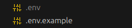
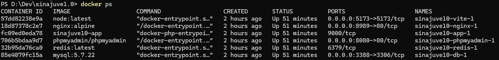
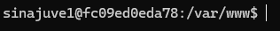

# Setup

Clone o projeto
```sh
git clone https://gitlab.com/laiane7777/sinajuve1.0
```
```sh
cd sinajuve1.0
```


Copie o arquivo .env.example para um novo arquivo chamado .env com TODO o conteúdo do .env.example
```sh
cp .env.example .env
```
Ex:



Com o docker aberto, rode os containers do projeto (pode demorar um pouco, aproveita e toma um café)
```sh
docker-compose up --build -d
```

Para verificar se tudo ocorreu certo, execute o comando
```sh
docker ps
```
O resultado deve ser algo assim:




Acesse a linha de comando do projeto
```sh
docker-compose exec app bash
```
Seu usuário vai ficar desse jeito



Execute os seguintes comandos:

```sh
composer install
```
```sh
php artisan key:generate
```
```sh
php artisan migrate
```
```sh
npm install
```

Por fim rode o vite
```sh
npm run dev
```

Acesse o projeto
[http://localhost:8989](http://localhost:8989)


Caso queria encerrar o docker
```sh
docker-compose down
```